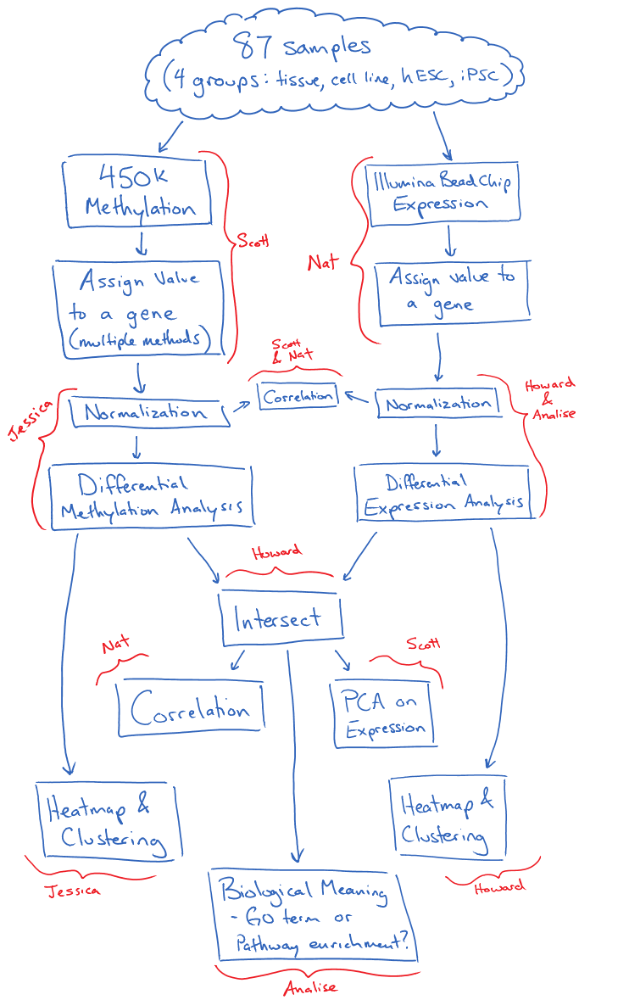

stat540-An Exploration of DNA Methylation in Stem vs. Somatic Cells, and How It Relates to Gene Expression
=================================

Project Proposal
=================

New Data
=========
We will be using data from http://www.ncbi.nlm.nih.gov/pmc/articles/PMC3348513/ for data on somatic tissues. 

For discussion on March 20th 2014: 
-----------------------------------
Supplementary Table 1 of this paper has fairly detailed information about the samples.  

Of the 336 samples (at the patient/cell line level), 228 had both expression and methylation analysis performed. 87 of those had the methylation analysis on 450K (the rest were the older 27K array).  

Of these 87 samples, there are 26 somatic tissue (taken from a patient, see table below of counts from each tissue), 20 somatic primary (cell lines, see counts below), 21 iPS cells (different passages), and 20 hESCs.  

Somatic Tissues|Counts
--------------|--------
Adipose|2
Adrenal|4
Bladder	|2
Kidney	|2
Liver	|1
Lung	|4
Lymph.node	|2
Skeletal.muscle	|2
Stomach	|4
Tongue	|1
Ureter	|2

Somatic Primary|Counts
---------------|------
Fetal Lung Fibroblast	|1
Fibroblast, lung	|1
Human Foreskin Fibroblast	|1
Human_Bladder_Smooth_Muscle_Cells	|1
Human_Brain_Vascular_Smooth_Muscle_Cells	|1
Human_Cardiac_Fibroblasts	|1
Human_Cardiac_Fibroblasts_Adult_Atrial	|1
Human_Dermal_Fibroblast	|2
Human_Dermal_Fibroblasts_Fetal	|1
Human_Esophageal_Smooth_Muscle_Cells	|1
Human_Intrahepatic_Biliary_Epithelial_Cells	|1
Human_Periodontal_Ligament_Fibroblasts	|1
Human_Skeletal_Muscle_Cells	|1
Keratinocyte	|2
Preadipocytes_visceral	|1
Renal Proximal Tubular Epithelial_Cells	|1
Renal_Cortical_Epithelial	|1
Renal_Epithelial_Cells	|1

Potential analysis (not a todo list, just possible ideas):  
1. Attempt different methods of assigning a single methylation value to a gene (mentioned in the above message).  
2. Differential methylation between our old neuronal samples and these new somatic primary cells (cell line to cell line comparison), or somatic tissue (cell line to normal tissue comparison)  
3. Differential methylation between somatic tissue and somatic primary (normal tissue to cell line comparison)  
4. Differential methylation between somatic cells and stem cells (mix to cell line comparison)  
5. Differential methylation between hESCs and iPSCs (cell line to cell line comparison) <- this may actually be interesting...what differences are there, if any, between a stem cell and an iPS cell? Probably already papers out there looking at this...?  
6. With whatever genes we found that have differential methylation, do they have differential expression? Is there any correlation with expression?  
7. If multiple ways of looking at methylation for a gene, which correlates with expression the best?  

What questions do we want to answer?
------------------------------------
- 87 Samples, matched 450K Methylation data, Illumina bead chip expression data  
- different ways to assess methylation: try an average, then work on other part of the pipeline, and then look at different combinations of methylation region combinations (Scott, Jessica)  
- get the differential gene anaylysis pipeline working (Nat, Analise, Howard)  
- See flowchart for workflow:  

Digital Supplement
====================
To go with our poster, we have created a digital supplement explaining the analysis in a little more detail. It can be found [here](digSup.md).