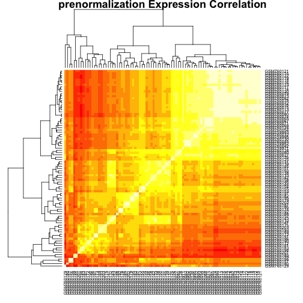
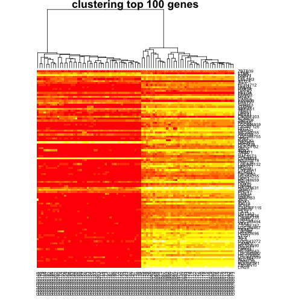
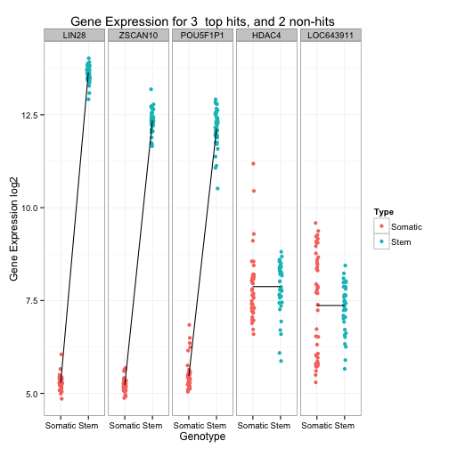

Expression Analysis 
========================================================
>Created by Analise Hofmann


```r
library(preprocessCore)
library(limma)
library(ggplot2)

avgExpByGene <- read.table(file = "expressionByGene.tsv")
log.avgExpByGene <- log2(avgExpByGene)  #log2 transform the data
dim(log.avgExpByGene)  #number of genes and samples we start with
```

```
## [1] 37805    87
```

```r

shortMeta <- read.table(file = "Modified.ExpMeta.tsv", header = T)
type <- read.table(file = "ESvsSomatic.txt")
shortMeta$Type <- type[, "V1"]  #adding on specification of whether or not the Sample is Stem Cell (ES), or Somatic (Somatic)
expMetaClean <- shortMeta

dim(expMetaClean)
```

```
## [1] 87  5
```

```r
colnames(expMetaClean)
```

```
## [1] "Sample.id"             "cell.type"             "cell.line.tissue.type"
## [4] "gender"                "Type"
```


```r
log.avgExpGeneClean <- na.exclude(log.avgExpByGene)  #remove genes that contain NA data

dim(log.avgExpGeneClean)  #number of genes and samples we use in the analysis
```

```
## [1] 21271    87
```

```r

heatmap(cor(log.avgExpGeneClean), scale = "none", main = "prenormalization Expression Correlation")  #There does not appear to be any very obvious outliers, and since the paper we got the data from did use all the samples, we included all the 87 Samples for further analysis
```

 

```r

log.avgExpCleanNorm <- data.frame(normalize.quantiles(as.matrix(log.avgExpGeneClean)))
colnames(log.avgExpCleanNorm) <- colnames(log.avgExpGeneClean)
row.names(log.avgExpCleanNorm) <- row.names(log.avgExpGeneClean)
heatmap(cor(log.avgExpCleanNorm), scale = "none", main = " post normalization Expression Correlation")
```

 


```r
model.ExpDat3 <- model.matrix(~Type, expMetaClean)  #make the design matrix based on cell type ES or Somatic
ExpFit3 <- lmFit(log.avgExpCleanNorm, model.ExpDat3)
ExpEbFit3 <- eBayes(ExpFit3)
topTableType <- topTable(ExpEbFit3, number = Inf, coef = grep("Type", colnames(coef(ExpEbFit3))))

# Make a heatmap of the top 100 genes.
heatmap(as.matrix(log.avgExpCleanNorm[c(row.names(topTableType[1:100, ])), ]), 
    scale = "none", Rowv = NA, main = "clustering top 100 genes")
```

 


```r
# make strip plots of expression, 3 top hits, 2 non hits
prepareData <- function(x, y, z) {
    jDat <- subset(x, rownames(x) %in% y)
    jDat <- data.frame(gExp = as.vector(t(as.matrix(jDat))), gene = factor(rep(rownames(jDat), 
        each = ncol(jDat), levels = y)))
    mouseDesign3 <- z
    mouseDesign3$Sample <- rownames(z)
    jDat <- suppressWarnings(data.frame(mouseDesign3, jDat))
}

genesOfInterest <- factor(c("LIN28", "ZSCAN10", "POU5F1P1", "HDAC4", "LOC643911"), 
    ordered = F)

jDat <- prepareData(log.avgExpCleanNorm, genesOfInterest, shortMeta)

jDat$gene <- factor(jDat$gene, ordered = T, levels = c("LIN28", "ZSCAN10", "POU5F1P1", 
    "HDAC4", "LOC643911"))

# swith ES to Stem in meta table to match Jessica's terms
jDat$Type <- as.character(jDat$Type)
jDat$Type[jDat$Type == "ES"] <- "Stem"
jDat$Type <- as.factor(jDat$Type)


# Make a plot of the top 3 and bottom 2 genes
ggplotLayer1 <- ggplot(jDat, aes(x = Type, y = gExp, color = Type))
ggplotLayer1 <- ggplotLayer1 + geom_point(position = position_jitter(width = 0.05))  #add a geometrics layer
ggplotLayer1 <- ggplotLayer1 + stat_summary(fun.y = mean, aes(group = 1), geom = "line", 
    color = "black")
ggplotLayer1 <- ggplotLayer1 + facet_grid(~gene)
((ggplotLayer1 <- ggplotLayer1 + theme_bw() + xlab("Genotype") + ylab("Gene Expression log2") + 
    ggtitle("Gene Expression for 3  top hits, and 2 non-hits")))
```

 


